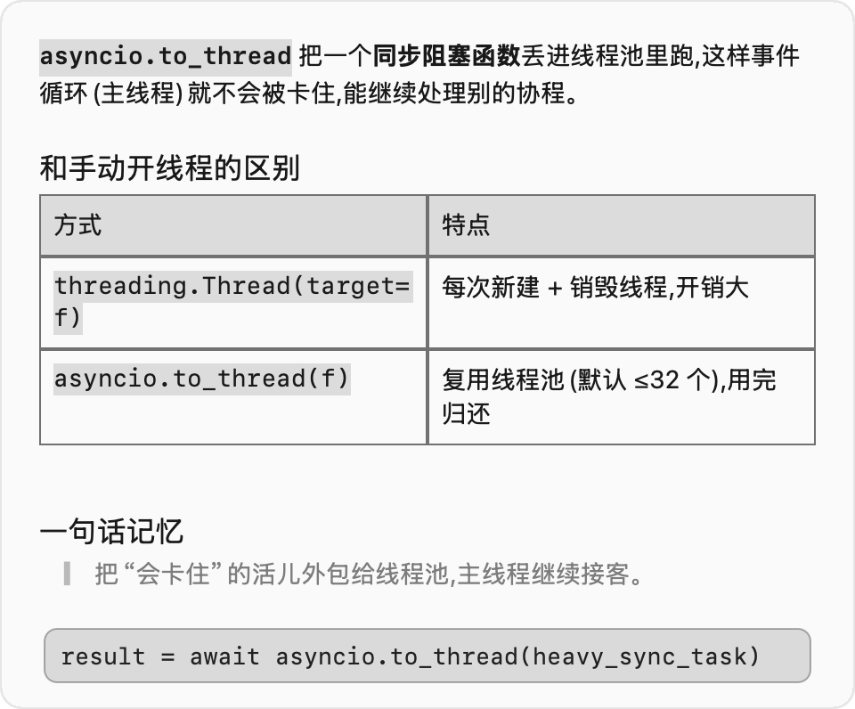
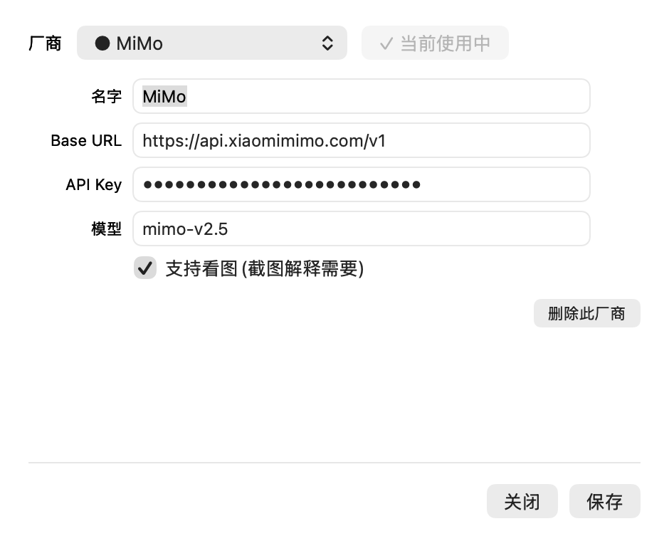

<div align="center">

# 🌐 popdict

### 划词即译 · 截图即解 · 原生丝滑的 macOS 桌面 AI 助手

**在任何 App 里选中文字,旁边立刻冒出「翻译 / 解释」;框选屏幕一块,让 AI 看着图讲给你听。**

免费 · 原生 · 隐私优先 —— 全程本地直连**你自己的**大模型,绝不经过任何第三方服务器。

<br>


</div>

<br>

> **一眼感受**:选中看不懂的代码/概念,点「💡 解释」——流式逐字弹出,完整 Markdown(标题 / 列表 / **表格** / 代码块 / 引用),还能带上下文继续追问。

<div align="center">

</div>

<br>

---

## ✨ 为什么用 popdict

- 🖱️ **选中即出结果** —— 不用复制、不用切窗口、不用打开网页。划完词,翻译/解释就贴在选区旁边。
- 📸 **截图让 AI 看图讲解** —— 报错截图、图表、外文界面、设计稿、一段文档…… 框一下,AI 直接看着图说人话。这是别家划词工具基本没有的。
- ⚡ **流式 + 富文本** —— 逐字打字机输出;完整 Markdown 渲染(标题 / 列表 / 代码块 / **表格** / 分隔线 / 引用 / 行内代码)。
- 💬 **带上下文追问** —— 解释完底部就是输入框,回车接着问,像聊天一样一轮轮深入。
- 🎛️ **模型自己挑** —— 内置 DeepSeek、小米 MiMo,也能加任意 **OpenAI 兼容** 厂商(自定义名字 / Base URL / Model / Key)。一个下拉随时切换。
- 🪟 **原生丝滑** —— 毛玻璃浮窗、淡入淡出、可拖拽自由缩放并**记住大小**,纯 AppKit、无 Electron、无后台全家桶。
- 🔒 **隐私优先** —— Key 只存你本机,内容只在你触发时**直连你选的厂商接口**,本程序不收集、不中转、不上传任何数据。
- 💸 **完全免费、零第三方依赖** —— 一个几百 KB 的菜单栏小程序,开箱即用。

<br>

## 🎬 看看长什么样

| 划词翻译 / 解释 | 截图解释 | 模型设置 |
|:---:|:---:|:---:|
| 选中文字 → 旁边冒「🌐 翻译 / 💡 解释」 | `⌃⌥E` 框选屏幕 → AI 看图讲解 | 下拉切厂商,填 Key 即用 |

<div align="center">

</div>

> 💡 想让 README 更带感?你可以把上面这张换成自己**实拍的 GIF**(划词 → 弹窗 → 流式出结果),冲击力拉满。

<br>

## 🚀 60 秒上手

**1. 装上它**

- **方式 A(推荐)**:到 [Releases](../../releases) 下载 `popdict.dmg` → 打开 → 把 `popdict.app` 拖进「应用程序」。
  首次打开请**右键 → 打开 → 再点「打开」**(只需这一次,绕过"未知开发者"提示)。菜单栏出现 🌐 即成功。
- **方式 B(自己编译)**:只需 macOS 自带命令行工具,无需完整 Xcode。
  ```sh
  cd popdict-app && bash build.sh   # 产出 universal 的 popdict.app 和 popdict.dmg
  ```

**2. 填一个模型 Key**

点菜单栏 🌐 → **「设置…」**,下拉选一个厂商(预置 DeepSeek / MiMo),填上它的 **API Key**,点保存。改完立刻生效、无需重启。

> 去哪申请:[小米 MiMo](https://platform.xiaomimimo.com/)(支持看图)· [DeepSeek](https://platform.deepseek.com/)。也可「+ 添加厂商」接任意 OpenAI 兼容服务。

**3. 授权辅助功能**

划词监听需要「辅助功能」权限:菜单栏 🌐 →「辅助功能权限设置…」,在 **系统设置 → 隐私与安全性 → 辅助功能** 里打开 popdict 的开关(打开后无需重启,自动开始监听)。

**搞定!** 在任意 App 选中文字试试,或按 `⌃⌥E` 框选屏幕。

<br>

## 🧩 怎么用

| 操作 | 怎么做 |
|------|--------|
| **翻译** | 选中文字 → 点「🌐 翻译」。含中文 → 英文;其它语言 → 简体中文。 |
| **解释** | 选中代码/概念 → 点「💡 解释」。流式 + Markdown,讲清"是什么 / 为什么 / 怎么用"。 |
| **追问** | 解释浮窗底部输入框,回车发送,带上下文继续问。 |
| **截图解释** | 按 `⌃⌥E`(或菜单「📷 截图解释」)→ 框选屏幕一块 → AI 看图讲解,可追问。`Esc` 取消。 |
| **缩放记忆** | 结果浮窗拖右下角握把(或拖边缘)改大小,**自动记住**,下次照这尺寸开。 |
| **复制 / 关闭** | 浮窗里可选中复制,点别处即关闭。 |

> 截图解释需要「屏幕录制」权限(只有这个功能用得到):首次按 `⌃⌥E` 会提示,去 **系统设置 → 隐私与安全性 → 屏幕录制** 打开 popdict(**首次授予后通常要重开 App 才生效**)。看图还要求当前厂商勾了「支持看图」(MiMo 预置已勾)。

<br>

## ⚙️ 模型厂商管理

popdict 不锁定任何一家——只要是 **OpenAI 兼容**(`/chat/completions`)的服务都能接。

- 设置窗口里用下拉选厂商,每个厂商可配 **名字 / Base URL / Model / API Key / 是否支持看图**。
- 选一个为「**● 当前使用**」,翻译/解释/看图都走它;随时切换、随时加新厂商。
- 配置存在本机 `~/.config/popdict/config.json`;老版本的 `mimo_key` 文件会在首启**自动迁移**进来,不丢配置。

| 预置厂商 | Base URL | 默认模型 | 看图 |
|------|------|------|:--:|
| DeepSeek | `https://api.deepseek.com/v1` | `deepseek-chat` | ✗ |
| 小米 MiMo | `https://api.xiaomimimo.com/v1` | `mimo-v2.5` | ✓ |

<br>

## 🔒 隐私

- **Key 只存你本机** `~/.config/popdict/config.json`,不会上传到任何地方。
- 选中的文字、截到的图,**只在你主动触发时**直接发给**你选的那家厂商**官方接口用于本次翻译/解释/看图。
- 本程序自身**不收集、不中转、不上传**任何数据,也没有任何遥测/账号体系。

<br>

## 🛠 工作原理

- **取词**:优先用 macOS 辅助功能(Accessibility)直接读选区文字;读不到时模拟一次 `⌘C`(用完自动还原你的剪贴板)。
- **冒泡**:全局鼠标事件监听(CGEventTap)感知"划选",在选区旁弹一个无边框毛玻璃浮窗。
- **翻译 / 解释**:调当前厂商的 `chat/completions`;解释开 `stream:true`,用 `URLSession.bytes` 逐行读 SSE、逐字渲染,结束后整体按 Markdown 重渲染(含 `NSTextTable` 表格)。
- **截图解释**:自带全屏遮罩框选,用 `CGWindowListCreateImage` 截「遮罩下方」真实画面,PNG/base64 后作为 `image_url` 随消息发给支持看图的厂商(多模态),复用同一套会话浮窗。

<br>

## ❓ 常见问题

<details>
<summary><b>划词不冒泡 / 没反应?</b></summary>

点菜单栏 🌐 看「辅助功能」是否打勾。没勾就去 系统设置 → 隐私与安全性 → 辅助功能 打开 popdict。日志在 `~/.config/popdict/popdict.log`。
</details>

<details>
<summary><b>截图解释没反应?</b></summary>

多半是「屏幕录制」权限没开、或刚开还没重启 App;也可能当前厂商没勾「支持看图」(切到 MiMo)。
</details>

<details>
<summary><b>更新后辅助功能授权丢了?</b></summary>

先在「钥匙串访问」建一个自签名代码签名证书,然后 `bash build.sh "你的证书名"` 用它签名——同一证书签名,TCC 授权不会因重编而失效。
</details>

<details>
<summary><b>能接 OpenAI / 通义 / Kimi / 本地 Ollama 吗?</b></summary>

能。只要对方提供 OpenAI 兼容的 `/chat/completions`,在设置里「+ 添加厂商」填上 Base URL、Model、Key 即可;看图功能取决于该模型是否支持多模态(勾上「支持看图」)。
</details>

<br>

## 🧰 另外两种轻量实现(可选)

不想装 App?仓库里还附了两种迷你方案:

| 实现 | 说明 | 需要 |
|------|------|------|
| **PopClip 扩展** | 双击 `DeepSeek-Translate.popclipext` 安装,在 PopClip 里填 Key,选中点 🌐 | [PopClip](https://pilotmoon.com/popclip/) |
| **Hammerspoon 脚本** | `popdict.lua` 用 `dofile` 加载,选中按 `⌘⇧T` 弹译文 | [Hammerspoon](https://www.hammerspoon.org/) |

> 这两种走 DeepSeek,配置在 `~/.config/popdict/deepseek_key`,详见各自文件注释。原生 App 才是主推。

<br>

## 📦 项目结构

```
popdict-app/         原生 App(Swift):main.swift / Markdown.swift / Screenshot.swift / Config.swift / Settings.swift
  └─ build.sh        一行命令打包 universal app + dmg
DeepSeek-Translate.popclipext/   PopClip 扩展
popdict.lua          Hammerspoon 脚本
images/              README 配图
```

<br>

## 📄 License

[MIT](./LICENSE) —— 随便用、随便改、随便分发。如果它帮到你,点个 ⭐ 就是最大的鼓励。
